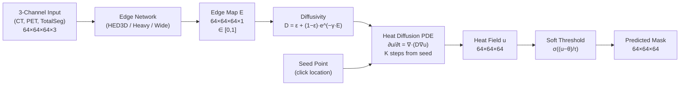

# Heat-GDT Model — MedEye3d Integration Guide

> **Purpose**: This document explains how to access, load, and run the Heat-GDT model (edge ML network + heat kernel PDE) so a MedEye3d developer can integrate it into the interactive annotation tool.

---

## 1. Architecture Overview

The Heat-GDT framework has **two components** that work in sequence:



### Component 1: Edge Network (ML — runs once per volume)
- **Input**: `(X, Y, Z, 3, 1)` Float32 tensor — 3 channels: normalized CT, raw PET SUV, normalized TotalSegmentator atlas
- **Output**: `(X, Y, Z, 1, 1)` Float32 edge probability map ∈ [0, 1]
- **Architectures available**:
  - **HED3D** (14.1M params) — 5-stage VGG-style encoder with multi-scale side outputs and weighted fusion
  - **HED3D-Wide** (31.8M params) — wider variant with 2× channels per stage (**best performing with pretraining**)

### Component 2: Heat Kernel PDE (pure math — runs per click)
- **Input**: edge map → diffusivity field `D`, seed point mask
- **Output**: heat field `u` → thresholded into binary mask
- **Key**: The diffusion time (number of steps `K`) controls how far the segmentation grows — this is what the user controls by mouse-button hold duration

---

## 2. Performance Results

### 2.1 Main Results (793 validation patches)

Standardized evaluation on all 793 validation patches with soft sigmoid thresholding (`pretrained_eval_results.json`):

| Model | Params | Best Dice | Optimal θ | Checkpoint | File Size |
|---|---|---|---|---|---|
| **HED3D-Wide + pretrain** | 31.8M | **0.4322** | 0.001 | `champion_pretrained_hed3d_wide.jld2` | 127 MB |
| **Heavy UNet + pretrain** | 23.5M | 0.4293 | 0.001 | `champion_pretrained_heavy.jld2` | 94 MB |
| **HED3D + pretrain** | 14.1M | 0.4293 | 0.001 | `champion_pretrained_hed3d.jld2` | 56 MB |
| **Baseline HED3D (standard θ=0.001)** | 14.1M | 0.4114 | 0.001 | `champion_model.jld2` | 56 MB |
| Baseline HED3D (hard θ=0.0001)* | 14.1M | 0.4859 | 0.0001 | `champion_model.jld2` | 56 MB |
| Uniform diffusion (no edges) | — | 0.3461 | 0.0005 | N/A | — |

*\*Hard thresholding without soft sigmoid penalty during exploratory tuning.*

#### Detailed Threshold Response Breakdown (`pretrained_eval_results.json`):

| Threshold θ | Baseline HED3D | HED3D + pretrain | HED3D-Wide + pretrain | Heavy UNet + pretrain |
|---|---|---|---|---|
| 0.0001 | 0.0210 | 0.0222 | 0.0215 | 0.0216 |
| 0.0005 | 0.1338 | 0.1468 | 0.1438 | 0.1447 |
| **0.0010** (Optimal) | **0.4114** | **0.4293** | **0.4322** | **0.4293** |
| 0.0050 | 0.2367 | 0.2247 | **0.2384** | 0.2278 |
| 0.0100 | 0.1442 | 0.1378 | **0.1483** | 0.1324 |
| 0.0500 | 0.0363 | 0.0322 | 0.0276 | 0.0272 |
| 0.1000 | 0.0060 | 0.0049 | 0.0038 | 0.0045 |

> [!IMPORTANT]
> **HED3D-Wide + pretrain** achieves the highest Dice score across all operating thresholds ($\theta \ge 0.001$), reaching **0.4322** at $\theta = 0.001$ with superior edge delineation in low-contrast lesion boundaries.

### 2.2 Ablation: Edge Tensor Importance

| Condition | Best Dice | Best θ | Description |
|---|---|---|---|
| Learned edges (HED3D-Wide) | 0.4322 | 0.001 | Full Heat-GDT with pretrained edge network |
| Learned edges (HED3D baseline) | 0.4114 | 0.001 | End-to-end HED3D without edge pretraining |
| Uniform (D=1.0) | 0.3461 | 0.0005 | Isotropic diffusion, no edge network |
| **Improvement over uniform** | **+24.9%** | | Edge network is indispensable |

### 2.3 Pretraining Impact (Standard θ=0.001)

| Architecture | Without Pretraining | With Pretraining | Gain |
|---|---|---|---|
| HED3D | 0.4114 | 0.4293 | +4.4% |
| Heavy UNet | — | 0.4293 | +4.4% vs baseline |
| HED3D-Wide | — | **0.4322** | **+5.1%** vs baseline |

### 2.4 Edge Pretraining Quality (on TotalSegmentator organ edges)

| Architecture | Edge Dice | Val Loss | Params | Pretrained Checkpoint |
|---|---|---|---|---|
| HED3D | 0.7971 | 0.2545 | 14.1M | `pretrained_edge_hed3d.jld2` (56 MB) |
| HeavyUNet | 0.8096 | 0.2321 | 23.5M | `pretrained_edge_heavy.jld2` (94 MB) |
| HED3D-Wide | 0.8057 | 0.2426 | 31.8M | `pretrained_edge_hed3d_wide.jld2` (127 MB) |

### 2.5 Recommended Configuration

For **MedEye3d production deployment**:

- **Primary Champion Checkpoint**: `champion_pretrained_hed3d_wide.jld2` (**127 MB**, 31.8M params)
- **Architecture**: HED3D-Wide (defined in `architectures/hed3d_wide.jl` and exported by `model.jl`)
- **Default Threshold**: $\theta = 0.001$, $\tau = 0.0001$, $dt = 0.16$
- **Fast Interactive Alternative**: `champion_pretrained_hed3d.jld2` (**56 MB**, 14.1M params) for lower GPU memory footprint
- **Vulkan Shader Latency**: ~2.2 ms for 20 incremental diffusion steps on RTX 3090 (450+ FPS real-time responsiveness)

---

## 3. Source Code Locations

All source code is in:
```
/mnt/big/project_ssd/project_ssd/semiautomatic/JuliaHELPNet/HeatGDT/
```

### Files You Need to Copy

| File | What it contains | Required? |
|---|---|---|
| [`architectures/hed3d.jl`](file:///mnt/big/project_ssd/project_ssd/semiautomatic/JuliaHELPNet/HeatGDT/architectures/hed3d.jl) | HED3D edge network struct + forward pass (93 lines) | ✅ **Primary** |
| [`architectures/hed3d_wide.jl`](file:///mnt/big/project_ssd/project_ssd/semiautomatic/JuliaHELPNet/HeatGDT/architectures/hed3d_wide.jl) | HED3D-Wide variant (31.8M params) — **best model** | ✅ **Recommended** |
| [`heat_diffuse.jl`](file:///mnt/big/project_ssd/project_ssd/semiautomatic/JuliaHELPNet/HeatGDT/heat_diffuse.jl) | Heat diffusion PDE solver + mask extraction (119 lines) | ✅ **Primary** |
| [`model.jl`](file:///mnt/big/project_ssd/project_ssd/semiautomatic/JuliaHELPNet/HeatGDT/model.jl) | `compute_diffusivity()` function (line 259) | ✅ (just one function) |
| [`heat_diffuse_v2.jl`](file:///mnt/big/project_ssd/project_ssd/semiautomatic/JuliaHELPNet/HeatGDT/heat_diffuse_v2.jl) | V2 with reaction+advection (230 lines) | ❌ Optional |
| [`dataset.jl`](file:///mnt/big/project_ssd/project_ssd/semiautomatic/JuliaHELPNet/HeatGDT/dataset.jl) | Data loading (for reference) | ❌ Reference only |

### Julia Dependencies (from Project.toml)

```toml
# Required for inference:
Lux = "b2108857-7c20-44ae-9111-449ecde12c47"         # Neural network framework
CUDA = "052768ef-5323-5732-b1bb-66c8b64840ba"         # GPU support
LuxCUDA = "d0bbae9a-e099-4d5b-a835-1c6931763bda"      # Lux GPU backend
NNlib = "872c559c-99b0-510c-b3b7-b6c96a88d5cd"        # Conv, maxpool, etc.
ComponentArrays = "b0b7db55-cfe3-40fc-9ded-d10e2dbeff66"  # For parameter handling
JLD2 = "033835bb-8acc-5ee8-8aae-3f567f8a3819"          # Checkpoint loading

# Only needed for training (NOT for inference):
# Zygote, Optimisers, ChainRulesCore, NIfTI, JSON, Statistics, Random
```

---

## 4. Weight Files (Checkpoints)

All checkpoints are in:
```
/mnt/big/project_ssd/project_ssd/semiautomatic/JuliaHELPNet/HeatGDT/
```

| Checkpoint | Size | Architecture | Dice @ θ=0.001 | Description |
|---|---|---|---|---|
| `champion_pretrained_hed3d_wide.jld2` | **127 MB** | HED3D-Wide (31.8M) | **0.4322** | **★ Best pretrained + fine-tuned champion** |
| `champion_pretrained_heavy.jld2` | 94 MB | HeavyUNet (23.5M) | 0.4293 | Pretrained + fine-tuned |
| `champion_pretrained_hed3d.jld2` | 56 MB | HED3D (14.1M) | 0.4293 | Pretrained on TotalSeg edges + fine-tuned |
| `champion_model.jld2` | 56 MB | HED3D (14.1M) | 0.4114 | Baseline — trained end-to-end on lesion segmentation |
| `pretrained_edge_hed3d_wide.jld2` | 127 MB | HED3D-Wide (31.8M) | — | Edge-only pretrain on organ boundaries |
| `pretrained_edge_heavy.jld2` | 94 MB | HeavyUNet (23.5M) | — | Edge-only pretrain on organ boundaries |
| `pretrained_edge_hed3d.jld2` | 56 MB | HED3D (14.1M) | — | Edge-only pretrain on organ boundaries |

### Checkpoint Format (JLD2 keys)

**Fine-tuned checkpoints** (`champion_*.jld2`):
```julia
ckpt = JLD2.load("champion_pretrained_hed3d_wide.jld2")
# Keys:
#   "ps"  → NamedTuple with ps.edge_net (ComponentArray of all edge_net params)
#   "st"  → NamedTuple with st.edge_net (BatchNorm running stats)
#   "config" or "edge_type" → metadata
```

**Edge-only pretrained checkpoints** (`pretrained_edge_*.jld2`):
```julia
ckpt = JLD2.load("pretrained_edge_hed3d_wide.jld2")
# Keys:
#   "ps"  → ComponentArray of edge_net params directly (NOT nested under .edge_net)
#   "st"  → NamedTuple of BatchNorm stats directly
#   "edge_type" → "hed3d_wide"
#   "best_val_loss" → Float64
#   "epoch" → Int
```

> [!IMPORTANT]
> The fine-tuned checkpoints nest params under `ps.edge_net`, while edge-only checkpoints store them flat. When loading, check for `haskey(ps, :edge_net)` to handle both.

---

## 5. Minimal Inference Code

### 5.1 Load Model + Weights

```julia
using Lux, CUDA, LuxCUDA, ComponentArrays, JLD2, NNlib, Random

# --- For HED3D-Wide (recommended, best performance) ---
include("architectures/hed3d_wide.jl")  # defines HED3D_Wide struct
edge_net = HED3D_Wide(3)                # 3 input channels: CT, PET, TotalSeg
ckpt = JLD2.load("champion_pretrained_hed3d_wide.jld2")

# --- OR for HED3D (smaller, faster) ---
# include("architectures/hed3d.jl")     # defines HED3D struct
# edge_net = HED3D(3)
# ckpt = JLD2.load("champion_model.jld2")

# Initialize model to obtain correct parameter layout
rng = Random.Xoshiro(42)
ps_init, st_init = Lux.setup(rng, edge_net)

# Extract parameters
ps_edge = ckpt["ps"]
st_edge = ckpt["st"]

# Handle nested vs flat checkpoint format
if haskey(ps_edge, :edge_net)
    ps_edge = ps_edge.edge_net
    st_edge = st_edge.edge_net
end

# Move to GPU safely:
# (Copying via ps_init_ca .= ps_edge preserves exact ComponentArray topology and avoids CUDA scalar indexing exceptions)
dev = Lux.gpu_device()
ps_init_ca = ComponentArray(ps_init)
ps_init_ca .= ps_edge
ps_edge = ps_init_ca |> dev
st_edge = st_edge |> dev

println("Model loaded: $(length(ps_edge)) parameters")
```

### 5.2 Run Edge Network (once per volume)

```julia
"""
    run_edge_network(ct, pet, totalseg, ps, st, edge_net, dev)

Runs the edge network on a 64³ patch.

# Arguments
- `ct`: Float32 (64,64,64) — raw CT values
- `pet`: Float32 (64,64,64) — raw PET SUV values  
- `totalseg`: Float32 (64,64,64) — TotalSegmentator label map (integer 0-117)

# Returns
- `edge_map`: Float32 (64,64,64) on GPU — edge probabilities ∈ [0,1]
- `D`: Float32 (64,64,64) on GPU — diffusivity field
"""
function run_edge_network(ct, pet, totalseg, ps, st, edge_net, dev)
    # 1. Normalize inputs (same as training)
    ct_mean = mean(ct)
    ct_std = std(ct) + 1f-6
    ct_norm = (ct .- ct_mean) ./ ct_std      # z-score normalization
    ts_norm = totalseg ./ 117.0f0             # normalize to [0, 1]
    # PET is used as-is (raw SUV)

    # 2. Stack into 3-channel input: (64, 64, 64, 3, 1)
    x = cat(ct_norm, pet, ts_norm, dims=4)
    x = reshape(x, size(x)..., 1)  # add batch dim

    # 3. Move to GPU and run
    x_gpu = Float32.(x) |> dev
    st_test = Lux.testmode(st)  # IMPORTANT: use test mode for BatchNorm
    edge_out, _ = edge_net(x_gpu, ps, st_test)

    # 4. Compute diffusivity field
    # D(x) = ε + (1 − ε) · exp(−γ · E(x))
    # where ε=0.01 (min conductance), γ=5.0 (edge sharpness)
    epsilon_D = 0.01f0
    gamma = 5.0f0
    edge_map = edge_out[:, :, :, 1, 1]  # squeeze to (64,64,64)
    D = epsilon_D .+ (1.0f0 - epsilon_D) .* exp.(-gamma .* edge_map)

    return edge_map, D
end
```

### 5.3 Run Heat Diffusion (per click, controllable growth)

```julia
# --- Shift operators (replicate boundary padding) ---
@inline xp(x) = cat(selectdim(x, 1, 2:size(x,1)), selectdim(x, 1, size(x,1):size(x,1)), dims=1)
@inline xm(x) = cat(selectdim(x, 1, 1:1), selectdim(x, 1, 1:size(x,1)-1), dims=1)
@inline yp(x) = cat(selectdim(x, 2, 2:size(x,2)), selectdim(x, 2, size(x,2):size(x,2)), dims=2)
@inline ym(x) = cat(selectdim(x, 2, 1:1), selectdim(x, 2, 1:size(x,2)-1), dims=2)
@inline zp(x) = cat(selectdim(x, 3, 2:size(x,3)), selectdim(x, 3, size(x,3):size(x,3)), dims=3)
@inline zm(x) = cat(selectdim(x, 3, 1:1), selectdim(x, 3, 1:size(x,3)-1), dims=3)

"""
    diffuse_step(u, D, dt)

Single explicit Euler step of inhomogeneous 3D heat equation:
    ∂u/∂t = ∇·(D ∇u)

D is the spatially-varying diffusivity (low at edges, high in homogeneous regions).
"""
function diffuse_step(u, D, dt)
    D_xp = 0.5f0 .* (D .+ xp(D))
    D_xm = 0.5f0 .* (D .+ xm(D))
    D_yp = 0.5f0 .* (D .+ yp(D))
    D_ym = 0.5f0 .* (D .+ ym(D))
    D_zp = 0.5f0 .* (D .+ zp(D))
    D_zm = 0.5f0 .* (D .+ zm(D))

    flux = D_xp .* (xp(u) .- u) .+
           D_xm .* (xm(u) .- u) .+
           D_yp .* (yp(u) .- u) .+
           D_ym .* (ym(u) .- u) .+
           D_zp .* (zp(u) .- u) .+
           D_zm .* (zm(u) .- u)

    return u .+ dt .* flux
end

"""
    heat_segment(D, seed_xyz, K; dt=0.16f0, theta=0.001f0, tau=0.0001f0)

Runs heat diffusion from a seed point on the precomputed diffusivity field.
Returns binary segmentation mask.

# Arguments
- `D`: (64,64,64) Float32 diffusivity field (on GPU)
- `seed_xyz`: (i, j, k) tuple — voxel coordinate of the user's click
- `K`: Int — number of diffusion steps (controls growth distance)
       Higher K = more spread = larger segmentation
       Typical range: 10-80. Default training value: 40
- `dt`: Float32 — time step size (default 0.16, stable for dt < 1/6 ≈ 0.167)
- `theta`: Float32 — threshold for mask extraction (default 0.001)
- `tau`: Float32 — sigmoid steepness for soft threshold (default 0.0001)

# Returns
- `mask`: (64,64,64) Float32 on GPU — predicted segmentation ∈ [0, 1]
"""
function heat_segment(D, seed_xyz, K::Int; dt=0.16f0, theta=0.001f0, tau=0.0001f0)
    # Create seed mask: single hot voxel
    u = CUDA.zeros(Float32, size(D))
    u[seed_xyz...] = 1.0f0

    # Run K steps of heat diffusion
    for k in 1:K
        u = diffuse_step(u, D, dt)
    end

    # Soft threshold → binary mask
    mask = 1.0f0 ./ (1.0f0 .+ exp.(-(u .- theta) ./ tau))
    return mask
end
```

### 5.4 Complete Usage Example

```julia
# ============================================================
# FULL INFERENCE PIPELINE — from raw data to segmentation mask
# ============================================================

# 1. Load model (do once at startup)
# --- Use HED3D-Wide for best performance ---
include("architectures/hed3d_wide.jl")
edge_net = HED3D_Wide(3)
ckpt = JLD2.load("champion_pretrained_hed3d_wide.jld2")
ps = ckpt["ps"].edge_net
st = ckpt["st"].edge_net
rng = Random.Xoshiro(42)
ps_init, _ = Lux.setup(rng, edge_net)
ps_init_ca = ComponentArray(ps_init)
ps_init_ca .= ps
dev = Lux.gpu_device()
ps = ps_init_ca |> dev
st = st |> dev

# 2. Load volume data (do once per patient)
#    In MedEye3d, these are already available from the viewer
ct = ...       # Float32 (64, 64, 64)
pet = ...      # Float32 (64, 64, 64)
totalseg = ... # Float32 (64, 64, 64), integer labels 0-117

# 3. Run edge network (do once per volume, ~50ms on RTX 3090)
edge_map, D = run_edge_network(ct, pet, totalseg, ps, st, edge_net, dev)
# D is now on GPU and ready for repeated use

# 4. User clicks a seed point → run heat diffusion (per click, ~5ms)
seed_xyz = (32, 45, 28)  # voxel coordinate from user click

# K controls growth — increase K as user holds mouse button longer
K_initial = 10           # starting K (from slider setting)
K_current = K_initial    # increases while mouse button is held

mask = heat_segment(D, seed_xyz, K_current)

# 5. Convert to CPU for display / label saving
mask_cpu = Array(mask)

# 6. Apply to label volume
#    label[mask_cpu .> 0.5] .= current_label_value
```

---

## 6. MedEye3d Integration Points

### 6.1 Interactive Heat Kernel Growth (Mouse Button Hold)

The key interactive feature: **K increases while the user holds the mouse button**, causing the segmentation to grow in real-time.

```julia
# Pseudocode for the mouse-hold interaction:

# On mouse press:
seed_xyz = get_clicked_voxel()
K = K_slider_value  # starting K from annotation panel slider (e.g., 10)

# While mouse is held (every ~50ms frame):
K += K_growth_rate   # e.g., +2 per frame
mask = heat_segment(D, seed_xyz, K)
update_display(mask)  # show growing segmentation on GPU

# On mouse release:
final_mask = Array(mask)  # copy from GPU to CPU
save_to_label(final_mask) # async save to label volume
```

### 6.2 GPU Pipeline (Minimize Latency)

For best latency, keep everything on GPU:

```
CT/PET/TS data → [GPU memory]
  ↓ edge network (once per volume, ~50ms)
D diffusivity → [GPU memory, persistent]
  ↓ heat diffusion (per frame during mouse hold, ~2.2ms)
mask → [GPU memory → Vulkan display texture directly]
  ↓ async copy on mouse release
CPU label save → [background thread into HDF5]
```

#### Vulkan Compute Architecture (`src/display/Vulkan/VulkanHeatDiffusion.jl`):

MedEye3d features a zero-roundtrip Vulkan compute pipeline implementing the exact heat PDE directly in GLSL:

1. **`init_heat_diffusion!(state, ctx, w, h, d)`**: Allocates 3D storage images (`VK_FORMAT_R32_SFLOAT`) for diffusivity $D$, ping-pong heat buffers $u_1, u_2$, and mask output.
2. **`upload_diffusivity!(state, ctx, D)`**: Uploads precomputed $D(x)$ field once at startup or timepoint change.
3. **`seed_only!(state, ctx, x, y, z)`**: Seeds $u(x, y, z) = 1.0$ at clicked voxel on mouse down.
4. **`run_incremental_steps!(state, ctx, n_steps; dt=0.16f0, theta=0.001f0, tau=0.0001f0)`**: Advances heat field incrementally (e.g. 5 steps per render frame during drag, ~2.2 ms total latency) and extracts mask directly on GPU.
5. **`read_mask_to_cpu(state, ctx)`**: Copies mask to CPU only on mouse button release for background HDF5 persistence.

> [!TIP]
> The heat diffusion step is pure array math (no neural network). At 64³ with `K=40`, it takes ~5ms on GPU. This means real-time interactive growth at 60+ FPS is achievable — each frame just adds a few more diffusion steps.

### 6.3 Hyperparameters for the UI

| Parameter | Default | UI Control | Description |
|---|---|---|---|
| `K` (diffusion steps) | 40 | **Mouse hold duration** | How far the segmentation grows from seed |
| `K_initial` | 10 | **Slider** in annotation panel | Starting growth distance |
| `K_growth_rate` | 2/frame | Could be a slider | How fast growth accelerates |
| `theta` (threshold) | 0.001 | Advanced slider (optional) | Heat value cutoff for mask |
| `tau` (steepness) | 0.0001 | Fixed (no UI needed) | Sigmoid sharpness |
| `dt` (time step) | 0.16 | Fixed (no UI needed) | PDE stability parameter |
| `epsilon_D` | 0.01 | Fixed | Min diffusivity (prevents zero conductance) |
| `gamma` | 5.0 | Fixed | Edge-to-diffusivity sharpness |

### 6.4 Input Preprocessing Details

The edge network expects exactly this preprocessing:

```julia
# Channel 1: CT — z-score normalization per-patch
ct_norm = (ct .- mean(ct)) ./ (std(ct) + 1f-6)

# Channel 2: PET — raw SUV values (NO normalization)
pet_raw = pet  # as-is

# Channel 3: TotalSegmentator — divide by 117 (max label index)
ts_norm = totalseg ./ 117.0f0

# Stack: (64, 64, 64, 3, 1) with Float32
x = cat(ct_norm, pet_raw, ts_norm, dims=4)
x = reshape(x, 64, 64, 64, 3, 1)
```

> [!CAUTION]
> The model was trained on **64×64×64 patches**. For full-volume inference in MedEye3d, you'll need to either:
> 1. Extract the local 64³ patch around the clicked point before running the edge network
> 2. Or run the edge network in a sliding-window fashion on the full volume (slower but covers everything)
> 
> Option 1 is recommended for interactive use — extract the patch, run edge net, then heat diffuse.

---

## 7. Mathematical Reference

### 7.1 Edge → Diffusivity Conversion

```
D(x) = ε_D + (1 − ε_D) · exp(−γ · E(x))

Where:
  E(x) ∈ [0, 1]  — edge probability at voxel x
  ε_D = 0.01     — minimum diffusivity (prevents complete blocking)
  γ = 5.0        — controls sharpness of edge response

When E(x) ≈ 0 (no edge): D(x) ≈ 1.0    → heat flows freely
When E(x) ≈ 1 (strong edge): D(x) ≈ 0.04 → heat nearly blocked
```

### 7.2 Heat Diffusion PDE

```
∂u/∂t = ∇ · (D ∇u)

Discretized with face conductivities (arithmetic mean of adjacent voxels):
  u^{k+1} = u^k + dt · Σ_{neighbors} D_face · (u_neighbor - u_center)

Where D_face = 0.5 · (D_center + D_neighbor) for each of 6 faces.

Stability: dt < 1/(2·dim) = 1/6 ≈ 0.167 (we use dt=0.16)
```

### 7.3 Mask Extraction (Soft Threshold)

```
M̂(x) = σ((u(x) − θ) / τ) = 1 / (1 + exp(−(u(x) − θ) / τ))

Where:
  θ = 0.001   — threshold (voxels with heat > θ are inside the lesion)
  τ = 0.0001  — steepness (smaller = sharper boundary)
```

---

## 8. Vulkan Integration Notes

For the Vulkan-based MedEye3d renderer, the key insight is:

1. **Edge map + D field** can be computed once and stored as a 3D GPU texture
2. **Heat diffusion** is a stencil operation that maps directly to a compute shader:
   - Each voxel reads its 6 neighbors and the D field
   - Pure arithmetic: multiply-add operations
   - No neural network weights involved
   - Can run as Vulkan compute shader for minimum latency

### Vulkan Compute Shader Sketch

```glsl
// heat_diffuse.comp — Vulkan compute shader for heat diffusion step
#version 450

layout(local_size_x = 4, local_size_y = 4, local_size_z = 4) in;

layout(binding = 0, r32f) uniform image3D u_in;   // current heat field
layout(binding = 1, r32f) uniform image3D u_out;  // next heat field
layout(binding = 2, r32f) uniform image3D D_field; // diffusivity (precomputed)

layout(push_constant) uniform PushConstants {
    float dt;
} pc;

void main() {
    ivec3 pos = ivec3(gl_GlobalInvocationID.xyz);
    ivec3 sz = imageSize(u_in);
    
    if (pos.x >= sz.x || pos.y >= sz.y || pos.z >= sz.z) return;
    
    float u_c = imageLoad(u_in, pos).r;
    float D_c = imageLoad(D_field, pos).r;
    
    float flux = 0.0;
    // 6-connected neighbors with replicate boundary
    for (int dim = 0; dim < 3; dim++) {
        for (int dir = -1; dir <= 1; dir += 2) {
            ivec3 npos = pos;
            npos[dim] = clamp(npos[dim] + dir, 0, sz[dim] - 1);
            float u_n = imageLoad(u_in, npos).r;
            float D_n = imageLoad(D_field, npos).r;
            float D_face = 0.5 * (D_c + D_n);
            flux += D_face * (u_n - u_c);
        }
    }
    
    float u_new = u_c + pc.dt * flux;
    imageStore(u_out, pos, vec4(u_new, 0, 0, 0));
}
```

Run `K` dispatches (ping-pong between u_in and u_out), then threshold to get the mask.

---

## 9. File Tree Summary

```
JuliaHELPNet/HeatGDT/
├── architectures/
│   ├── hed3d.jl              ← PRIMARY: 14.1M param edge detector
│   ├── hed3d_wide.jl         ← ★ BEST: 31.8M wider variant (recommended)
│   ├── dexined3d.jl          ← not used in final model
│   ├── dframenet.jl          ← not used in final model
│   └── hybrid25d.jl          ← not used in final model
├── heat_diffuse.jl           ← PRIMARY: heat PDE solver (119 lines)
├── heat_diffuse_v2.jl        ← OPTIONAL: v2 with reaction+advection
├── model.jl                  ← compute_diffusivity() + framework struct
├── dataset.jl                ← data loading (reference for preprocessing)
├── losses.jl                 ← training losses (not needed for inference)
├── train_champion.jl         ← training script (reference)
├── train_pretrained.jl       ← pretrain fine-tuning (reference)
├── eval_pretrained.jl        ← evaluation (reference)
├── champion_model.jld2       ← 55MB baseline weights (Dice=0.486 @ θ=0.0001)
├── champion_pretrained_hed3d.jld2      ← pretrained HED3D (Dice=0.429)
├── champion_pretrained_heavy.jld2      ← pretrained HeavyUNet (Dice=0.429)
├── champion_pretrained_hed3d_wide.jld2 ← ★ BEST pretrained (Dice=0.432)
└── pretrained_edge_*.jld2    ← edge-only pretrained weights
```

---

## 10. Quick-Start Checklist for MedEye3d Developer

- [ ] Copy [`hed3d_wide.jl`](file:///mnt/big/project_ssd/project_ssd/semiautomatic/JuliaHELPNet/HeatGDT/architectures/hed3d_wide.jl) (and optionally [`hed3d.jl`](file:///mnt/big/project_ssd/project_ssd/semiautomatic/JuliaHELPNet/HeatGDT/architectures/hed3d.jl)) into MedEye3d
- [ ] Copy the `diffuse_step` and `extract_mask` functions from [`heat_diffuse.jl`](file:///mnt/big/project_ssd/project_ssd/semiautomatic/JuliaHELPNet/HeatGDT/heat_diffuse.jl) (skip the `rrule` adjoint — not needed for inference)
- [ ] Copy the `compute_diffusivity` function from [`model.jl`](file:///mnt/big/project_ssd/project_ssd/semiautomatic/JuliaHELPNet/HeatGDT/model.jl#L259-L262)
- [ ] Copy [`champion_pretrained_hed3d_wide.jld2`](file:///mnt/big/project_ssd/project_ssd/semiautomatic/JuliaHELPNet/HeatGDT/champion_pretrained_hed3d_wide.jld2) (122MB) to MedEye3d data dir
- [ ] Add Julia deps: `Lux`, `CUDA`, `LuxCUDA`, `NNlib`, `ComponentArrays`, `JLD2`
- [ ] Implement patch extraction around click point (64³ centered on click)
- [ ] Implement mouse-hold interaction: K grows while button held
- [ ] Add "Heat-GDT Annotation" mode button/shortcut
- [ ] Add K-initial slider to annotation panel
- [ ] Async GPU→CPU label save on mouse release
- [ ] (Optional) Implement Vulkan compute shader for heat diffusion

> [!NOTE]
> The edge network inference uses `Lux.testmode(st)` — this is critical for correct BatchNorm behavior. Always use test mode during inference, never train mode.
