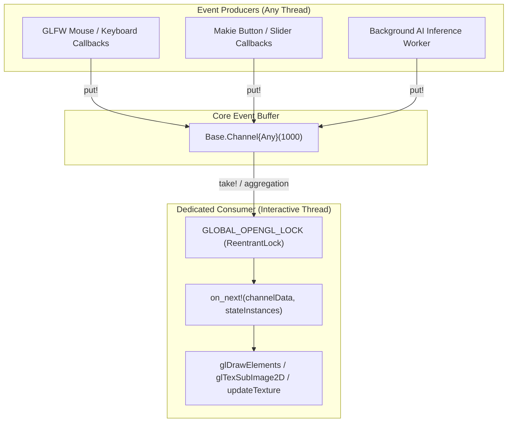

# Developer Playbook & Internal Architecture

This playbook provides core architectural documentation, concurrency rules, lock guidelines, and developer workflows for contributors to MedEye3d.jl.

---

## 1. Concurrency & OpenGL Threading Architecture

### The Single-Thread Constraint
OpenGL context objects (`HGLRC` on Windows, `GLXContext` on Linux/X11) are strictly thread-bound. Calling OpenGL functions from any OS thread other than the context owner causes memory corruption or crashes.

Julia's task scheduler can migrate tasks between OS worker threads across yield points (`take!`, `sleep`, channel waits). To guarantee thread safety:

1. **Dedicated Consumer Task**: The consumer loop in `SegmentationDisplay.jl` is created with `spawn=false` on the interactive threadpool:
   ```julia
   mainMedEye3dInstance = MainMedEye3d(
       channel = Base.Channel{Any}(consumer, 1000; spawn=false),
       ...
   )
   ```
2. **Global OpenGL Lock (`GLOBAL_OPENGL_LOCK`)**: A `ReentrantLock` synchronizes OpenGL resource access between GLFW texture rendering and GLMakie UI render loops.



---

## 2. Physical Aspect Ratio & Viewport Layout Architecture

MedEye3d visualizes 2D and 3D medical volumes across multiple viewports:
- **`SingleImage`**: Full-window single panel (or maximized panel after double-click).
- **`MultiImage`**: 2 side-by-side timepoint comparison panels (Left: Pos 1, Right: Pos 2 or 5).
- **`QuadImage`**: 4-panel quadrant display (1: Top-Left Axial, 2: Top-Right Axial PET, 3: Bottom-Left Sagittal, 4: Bottom-Right Coronal).

### Physical Anatomical Aspect Ratio
Medical image voxels possess physical spacings $(\Delta_x, \Delta_y, \Delta_z)$ in millimeters (e.g. $0.976\,\text{mm} \times 0.976\,\text{mm} \times 3.0\,\text{mm}$).

When extracting a 2D slice:
- $\text{imageTextureWidth} = \text{pixels along horizontal axis } (W_{\text{px}})$
- $\text{imageTextureHeight} = \text{pixels along vertical axis } (H_{\text{px}})$
- $\text{heightToWithRatio} = \frac{\Delta_{\text{vertical}}}{\Delta_{\text{horizontal}}}$

The true physical aspect ratio is:
$$\text{ratio\_desired} = \frac{\text{Physical Height (mm)}}{\text{Physical Width (mm)}} = \text{heightToWithRatio} \times \frac{\text{imageTextureHeight}}{\text{imageTextureWidth}}$$

### Universal Scale & Centering Engine
Inside `StructsManag.getMainVerticies`, scaling is computed by comparing the physical desired ratio to the panel's actual pixel ratio:

- If $\text{ratio\_actual} > \text{ratio\_desired}$ (panel is taller than image):
  $$\text{scale}_y = \frac{\text{ratio\_desired}}{\text{ratio\_actual}}, \quad \text{scale}_x = 1.0$$
- If $\text{ratio\_actual} \le \text{ratio\_desired}$ (panel is wider than image):
  $$\text{scale}_x = \frac{\text{ratio\_actual}}{\text{ratio\_desired}}, \quad \text{scale}_y = 1.0$$

The centered quad vertices in OpenGL Normalized Device Coordinates (NDC) are:
$$X_{\text{center}} = \frac{X_{\min} + X_{\max}}{2}, \quad \text{half}_x = \frac{X_{\max} - X_{\min}}{2} \cdot \text{scale}_x \implies [X_{\text{center}} - \text{half}_x, X_{\text{center}} + \text{half}_x]$$
$$Y_{\text{center}} = \frac{Y_{\min} + Y_{\max}}{2}, \quad \text{half}_y = \frac{Y_{\max} - Y_{\min}}{2} \cdot \text{scale}_y \implies [Y_{\text{center}} - \text{half}_y, Y_{\text{center}} + \text{half}_y]$$

---

## 3. Adding New Event Types to the Dispatch System

To add a new interactive feature:

1. **Define Event Struct** in `src/structs/MakieEvents.jl`:
   ```julia
   struct CustomFeatureEvent
       intensity_factor::Float32
   end
   ```
2. **Implement Handler Function** in `src/display/GLFW/MakieEventHandlers.jl`:
   ```julia
   function reactToCustomFeature(data::CustomFeatureEvent, mainStates::Vector{StateDataFields})
       # Update state or trigger shader parameter update
   end
   ```
3. **Register in `on_next!` Consumer** in `src/display/GLFW/SegmentationDisplay.jl`:
   ```julia
   on_next!(data::CustomFeatureEvent, mainStates::Vector{StateDataFields}) = MakieEventHandlers.reactToCustomFeature(data, mainStates)
   ```
4. **Wire UI Widget** in `src/display/LesionMetadataWindow.jl`:
   ```julia
   on(btn_custom.clicks) do _
       put!(channel, CustomFeatureEvent(1.5f0))
   end
   ```

---

## 4. Running the Test Suite

MedEye3d contains automated unit and regression test suites for all GPU kernels, post-processing filters, and UI dispatchers:

```bash
# Run all tests on host machine
julia --project=. test/runtests.jl

# Run specific test files
julia --project=. test/test_connected_components.jl
julia --project=. test/test_stroke_rasterization.jl
julia --project=. test/test_quad_image.jl
```
