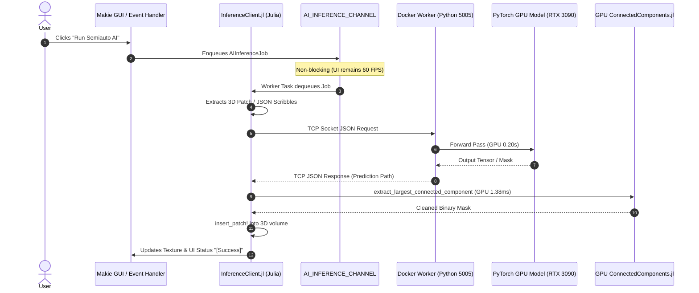

# AI Inference Pipeline & Docker Worker Architecture

MedEye3d.jl features an asynchronous, containerized deep learning inference engine supporting both semi-automated CNN architectures (**HELPNet**) and interactive foundation models (**MIC-DKFZ NNInteractive**).

---

## 1. System Overview & Architecture

To avoid heavy Python/PyTorch dependencies in the Julia runtime and maintain high interactive frame rates in OpenGL, AI inference runs in an isolated Docker container (`medeye3d-ai`) with direct GPU access.



---

## 2. Models Supported

### HELPNet (Nuclear Medicine Lesion Segmentation)
- **Modality Input**: 3 channels:
  1. Hounsfield Unit normalized CT patch ($64 \times 64 \times 64$).
  2. Raw PET SUV patch ($64 \times 64 \times 64$).
  3. Single-point prompt channel (point centered at $[33, 33, 33]$).
- **Inference Mode**: 3D sliding-window focal patch inference.
- **Post-Processing**: Filtered through `MedEye3d.ConnectedComponents.extract_largest_connected_component` to remove false-positive background noise islands.

### NNInteractive (MIC-DKFZ Foundation Model)
- **Modality Input**: Full-volume CT only (PET is not used).
- **Prompt Input**: Painted scribbles or point clicks.
- **Spatial Orientation**: Transposed $(X, Y, Z) \leftrightarrow (Z, Y, X)$ to conform to nnU-Net convention.
- **Optimizations**:
  - `set_do_autozoom(False)`: Focuses GPU computation on the target lesion ROI, executing in **~0.25s** on RTX 3090.
  - **In-Memory Session Caching**: Loaded CT scans are retained across interactions, eliminating redundant 300MB disk I/O.
  - **Direct JSON Scribble Coordinates**: Voxel coordinates are transmitted over TCP JSON, completely bypassing disk serialization.

---

## 3. Communication Protocol & Latency Breakdown

The Docker server listens on TCP port `5005` accepting JSON commands:

### HELPNet Request
```json
{
  "command": "helpnet",
  "ct_path": "/tmp/medeye3d_inference/ct_in.nii.gz",
  "pet_path": "/tmp/medeye3d_inference/pet_in.nii.gz",
  "point_path": "/tmp/medeye3d_inference/point_in.nii.gz",
  "out_dir": "/tmp/medeye3d_inference"
}
```

### NNInteractive Request
```json
{
  "command": "nninteractive",
  "ct_path": "/tmp/medeye3d_inference/nn_ct_HASH.nii.gz",
  "scribble_coords": [[250, 250, 140], [251, 250, 140]],
  "out_dir": "/tmp/medeye3d_inference"
}
```

### Latency Comparison (RTX 3090)
| Stage | Before Optimization | After Optimization | Speedup |
| :--- | :--- | :--- | :--- |
| **CT File Load & Transpose** | ~0.80 s (every click) | **0.00 s** (cached in session) | $\infty$ |
| **CT Volume Preprocessing** | ~0.70 s (every click) | **0.00 s** (cached in session) | $\infty$ |
| **Scribble Serialization** | ~1.50 s (3D NIfTI file generation) | **0.0001 s** (direct JSON array) | ~15,000x |
| **nnInteractive GPU Inference** | 1.7 s to 13.8 s (76-box AutoZoom) | **0.20 s – 0.25 s** (`do_autozoom=False`) | **~60x** |
| **End-to-End Julia Turnaround** | **3.35 s – 16.88 s** | **0.288 s** | **Up to 58x faster** |

---

## 4. Julia Client API

```julia
using MedEye3d.InferenceClient

# Run HELPNet
pred_mask = run_helpnet_inference(ct_vol, pet_vol, click_x, click_y, click_z)

# Run NNInteractive
pred_mask = run_nninteractive(ct_vol, pet_vol, scribble_mask, click_x, click_y, click_z)
```
